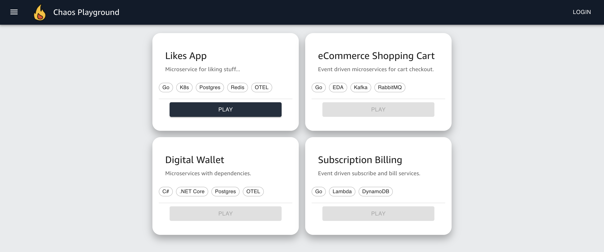

  

<h1 align="center">
  Chaos Playground
</h1>

    <!-- <a href="" target="blank">View Demo</a> -->
    ·
    <a href="https://github.com/farhanangullia/chaos-playground/issues/new/choose">Report Issue</a>
    ·
    <a href="https://github.com/farhanangullia/chaos-playground/issues/new/choose">Request Feature</a>

#### Need to architect and develop more resilient services?
This web portal is composed of micro apps of various software and architectural patterns on various use cases for developers and architects to practice chaos experiments against.

<!-- ## 🚀 Demo

Try the app: [Chaos Playground]() -->

## 🌟 Features

- **OAuth Login**
- **Access to 4 micro apps**
- **Responsive UI**
  
## 🌟 Micro Apps

- **Likes App**
  
<!-- ## 🛠️ Installation Steps -->

## License

This project is licensed under the Apache-2.0 License.