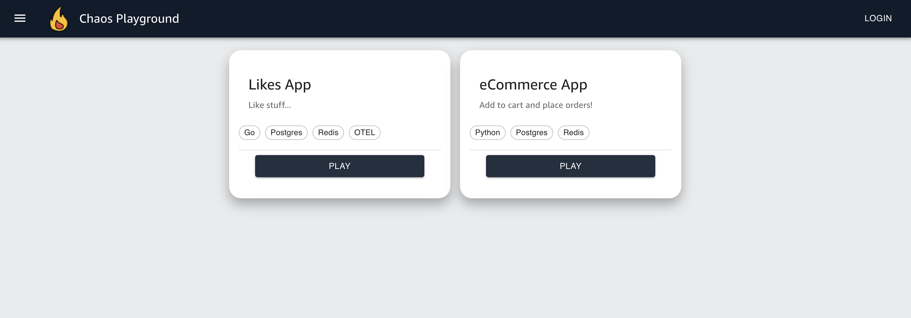

<p align="center">
  <a href="https://github.com/farhanangullia/chaos-playground">
    
  </a>
</p>
<h1 align="center">
  Chaos Playground
</h1>

<p align="center">
<a href="https://github.com/farhanangullia/chaos-playground/blob/main/LICENSE" target="blank">

</a>
<!-- <a href="https://github.com/farhanangullia/chaos-playground/fork" target="blank">

</a> -->
<!-- <a href="https://github.com/farhanangullia/chaos-playground/stargazers" target="blank">

</a> -->
<a href="https://github.com/farhanangullia/chaos-playground/issues" target="blank">

</a>
<a href="https://github.com/farhanangullia/chaos-playground/pulls" target="blank">

</a>
</p>

<p align="center"></p>

<p align="center">
    <a href="https://chaosplayground.netlify.app" target="blank">View Demo</a>
    ·
    <a href="https://github.com/farhanangullia/chaos-playground/issues/new/choose">Report Issue</a>
    ·
    <a href="https://github.com/farhanangullia/chaos-playground/issues/new/choose">Request Feature</a>
</p>

#### Need to architect and develop more resilient services?
This web portal is composed of micro apps of various software and architectural patterns on various use cases for developers and architects to practice chaos experiments against.


## 🚀 Demo
[](https://app.netlify.com/sites/chaosplayground/deploys)

Try the app: [Chaos Playground](https://chaosplayground.netlify.app)

## ✨ Features

- **Responsive UI**
- **OAuth Login**
- **Access to 2 micro apps (and counting)**

## 🌟 Micro Apps


| App       	| Services                      	| Language 	| Highlights 	|
|-----------	|-------------------------------	|----------	|------------	|
| Likes App 	| [like-service](https://github.com/farhanangullia/likes-app/tree/main/like-service), [counter-service](https://github.com/farhanangullia/likes-app/tree/main/counter-service) 	| Go       	| Repository Pattern, OpenTelemetry        	|
| eCommerce App 	| [catalog-service](https://github.com/farhanangullia/ecommerce-app/tree/main/catalog-service), [cart-service](https://github.com/farhanangullia/ecommerce-app/tree/main/cart-service), [order-service](https://github.com/farhanangullia/ecommerce-app/tree/main/order-service), [shipping-service](https://github.com/farhanangullia/ecommerce-app/tree/main/shipping-service) 	| Python, Go       	| Hexagonal Architecture, Clean Architecture        	|

## 🛠️ Installation Steps

### Docker
> **_NOTE:_**  By default, Auth is disabled. Set Auth0 values in examples/docker/docker-compose.yaml to enable auth for accessing the apps.

Clone repository:
```
git clone https://github.com/farhanangullia/chaos-playground.git
```

Initialize submodules:
```
make init
```

Deploy with compose:
```
make start
```

> Navigate to the Chaos Playground UI in your web browser by visiting http://localhost:8080.

Clean up:
```
make stop
```

## License

This project is licensed under the Apache-2.0 License.
